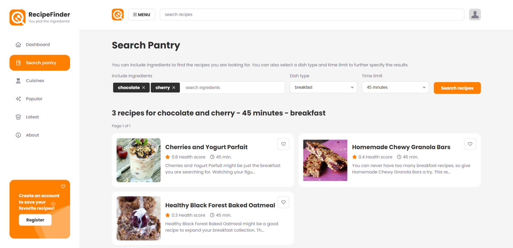

<div id="top"></div>

<div align="center">
  <a href="https://github.com/davebeerensdesigns/fronted-integral-assignment-recipe-finder">
    
  </a>

<h3 align="center">RecipeFinder</h3>

  <p align="center">
    React application that helps you find recipes based on ingredients in your pantry!
    <br />
    <a href="https://github.com/davebeerensdesigns/fronted-integral-assignment-recipe-finder"><strong>Explore the docs »</strong></a>
  </p>
</div>


<!-- TABLE OF CONTENTS -->
<details>
  <summary>Table of Contents</summary>
  <ol>
    <li>
      <a href="#about-the-project">About The Project</a>
      <ul>
        <li><a href="#built-with">Built With</a></li>
      </ul>
    </li>
    <li>
      <a href="#getting-started">Getting Started</a>
      <ul>
        <li><a href="#prerequisites">Prerequisites</a></li>
        <li><a href="#installation">Installation</a></li>
      </ul>
    </li>
    <li><a href="#usage">Usage</a></li>
    <li><a href="#roadmap">Roadmap</a></li>
    <li><a href="#contributing">Contributing</a></li>
    <li><a href="#license">License</a></li>
    <li><a href="#contact">Contact</a></li>
    <li><a href="#acknowledgments">Acknowledgments</a></li>
  </ol>
</details>


<!-- ABOUT THE PROJECT -->
## About The Project

<a href="https://github.com/davebeerensdesigns/fronted-integral-assignment-recipe-finder">
    
  </a>

<i>Disclaimer: This is a school project for my education at NOVI Hogeschool - ICT Opleiding. I am following the HBO Software development education. This project is built for the Frontend development course. It is not meant to be used as a real application.</i>

Do you never know what to cook tonight? Does it seem as if your creativity and decisiveness around dinner time has also suddenly disappeared? And then resist yourself to go shopping. Personally, I experience this about every day. That is why I built this app where you can enter a number of ingredients, after which this application will propose a number of suitable recipes to choose from. For example, when someone is short on time, the application will suggest more quick recipes.

On the days when the user does feel like going shopping, there is also an option to browse through all available recipes and search for specific recipes using a search function.

To do this I make HTTP requests to the Spoontacular API (https://spoonacular.com/food-api/docs) to request the correct data and process it in my application.

Finally, the user also has the option to add recipes to a favorites list to quickly find them.
To do this I use the NOVI backend where a user can create an account. I use the information field to store recipe IDs.

<p align="right">(<a href="#top">back to top</a>)</p>


### Built With

* [React.js](https://reactjs.org/)
* [Spoonacular](https://spoonacular.com/food-api/docs)
* [Novi Educational Backend](https://github.com/hogeschoolnovi/novi-educational-backend-documentation)
* [FontAwesome](https://fontawesome.com/)
* [Google Fonts](https://fonts.google.com/)

<p align="right">(<a href="#top">back to top</a>)</p>


<!-- GETTING STARTED -->
## Getting Started

To get a local copy up and running follow these simple example steps.

### Prerequisites

To setup the application you need to install npm. You also need API keys for Spoonacular and FontAwesome Pro.

* npm
  ```sh
  npm install npm@latest -g
  ```

### Installation

1. Get a API Key for Spoonacular and FontAwesome Pro. These can also be found in the Functional Requirements document provided by the developer.
2. Clone the repo
   ```sh
   git clone https://github.com/davebeerensdesigns/fronted-integral-assignment-recipe-finder.git
   ```
3. Create a .env file in the root folder and the following text:
   ```sh
    REACT_APP_API_KEY=***************
   ```
   Replace the * for the Spoonacular api key.
4. Create a .npmrc file with fontawesome authToken to use fontawesome pro icons.
   ```sh
   @fortawesome:registry=https://npm.fontawesome.com/ //npm.fontawesome.com/:_authToken=********************
   ```
   Replace the * for the fontawesome authToken.
5. Install NPM packages
   ```sh
   npm install
   ```

<p align="right">(<a href="#top">back to top</a>)</p>


<!-- USAGE EXAMPLES -->
## Usage


TUTORIALS USED
https://www.digitalocean.com/community/tutorials/react-tabs-component
https://www.bezkoder.com/react-hooks-jwt-auth/
https://towardsdatascience.com/react-js-basic-hooks-usestate-useeffect-usecontext-1ed82a799db2
https://www.bezkoder.com/handle-jwt-token-expiration-react/
https://soshace.com/react-user-login-authentication-using-usecontext-and-usereducer/